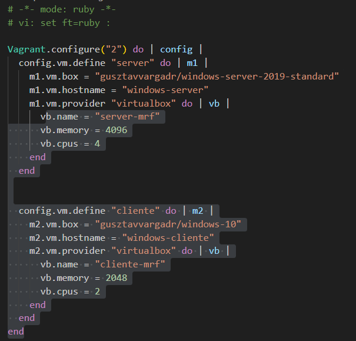

Esta sera la configuracion que desearemos realizar en esta practica.
Acto seguido haremos `vagrant up` para que se instalen correctamente y se arranquen, despues si queremos conectarnos a alguna de las dos la orden sera `vagrant ssh` mas el nombre que le habremos puesto en el **define** de la configuración