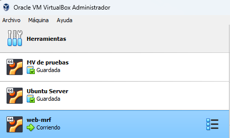

# PR0103: Configuracion servidor Web

Lo primero que haremos sera ejecutar el comando `vagrant init` para crear el fichero **vagrantfile** y asi poder configurar la maquina virtual como nosotros deseemos

A continuación, ejecutaremos la orden `vagrant box` junto al nombre de la iso que queremos descargar para poder crear nuestra maquina en este caso sera **generic/ubuntu2204**

Una vez descargado esta ISO abriremos el archivo **vagrantfile** y procedemos a la configuración que se mostrara a continuación

```ruby
# -*- mode: ruby -*-
# vi: set ft=ruby :

Vagrant.configure("2") do | config |
  config.vm.box = "generic/ubuntu2204"
  config.vm.hostname = "Web_server"
  config.vm.provider "virtualbox" do | vb |
    vb.name = "web_mrf"
    vb.memory = 3072
    vb.cpus = 2
  end
  config.vm.network "private_network", ip: "192.168.200.10"
  config.vm.network "public_network", ip: "10.9.9.10"
end
```

Despues de realizar esata configuración procederemos a ejecutar `vagrant up` para que se empiece a crear la maquina con las configuraciones realizadas previamente

Despues comprobamos que se nos ha creado la maquina correctamente abriendo virtualbox

