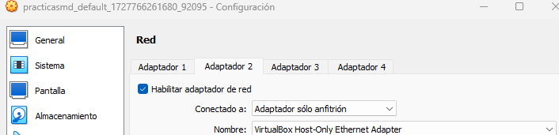

Abrimos la aplicacion de `VirtualBox` y nos aseguramos que la maquina se encuentra apagada, una vez comprobado vamos a **configuracion** > **red** > **adaptador2** y marcamos la casilla de **habilitar adaptador**, una vez marcada, en el  selector desplegable escogemos la opcion adaptador solo anfitrion como en la captura que se muestra y le damos a aceptar

Ahora ejecutaremos la maquina virtual con vagrant up para arrancar la maquina y luego vagrant ssh para conectarnos a la maquina

Despues, querremos conocer cual es la ip que nos ha asignado por defecto el virtualbox al adaptador de red que acabamos de crear.

Para ello usaremos la orden `ipconfig` en la maquina anfitriona y podremos conocer las ip de ambos adaptadores

Acto seguido haremos un **ping a la ip del adaptador** para comprobar que podemos realizar la conexión

Modificamos este archivo y le ponemos una IP estatica

