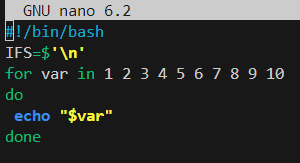

# Primer script


# Segundo script
```bash
#!/bin/bash
IFS=$'\n'
for i in {1..50}
do
 echo "$i"
 i=$(( $i +$i  ))
done
```

# Tercer script
```bash
#!/bin/bash
IFS=$'\n'
read -p "Introduce un numero: " numero
for tabla in {1..10}
do
 echo $numero=$(($numero *$tabla))
done

```

# Cuarto script

```bash

```


# Septimo script
```bash
#!/bin/bash
IFS=$"\n"
read -p "Introduce un numero: " numero
until [ $numero -lt 10  ]
do
  echo "$numero"
  numero=$(( $numero -1  ))
done
```

# Octavo script
```bash
#!/bin/bash
IFS=$"\n"
for file in /home/vagrant/*.txt
do
  if [ -d "$file"  ]
  then
     echo "$file es un directorio"
  elif [ -f "$file"  ]
  then
     echo "$file es un archivo"
  fi
done
```
# Noveno script
```bash
#!/bin/bash
read -p "Introduce un numero: " num

fact=1
for i in $(seq 2 $num)
do
   fact=$(( fact * i  ))
done
echo El factorial de $num es $fact

```

# Decimo script
```bash
#!/bin/bash
IFS=$"\n"
read -p "Dime una contraseña: " intento
until [ $intento = paso ]
do
    echo "Prueba de nuevo"
    read -p "Dime una contraseña: " intento
    echo "Has acertado"
done
```

# Undecimo script
```bash
#!/bin/bash
numero=7
read -p "Introduce un numero del 1 al 10: " num
while [ $numero != $num ]
do
   echo "Prueba de nuevo"
   read -p "Introduce de nuevo: " num
done
if [ $numero = $num  ]
then
 echo "Has acertado"
fi
```
# Decimotercer script
```bash
#!/bin/bash
read -p "Introduce un numero: " num

suma=0
cont=0
while [ $num != "fin" ]
do
    suma=$(( $suma + $num  ))
    cont=$(( $cont + 1  ))
    read -p "Introduce un numero: " num
done
echo Has introducido $cont numeros
echo Su suma es $suma
echo Y su promedio $=(( $suma / $cont ))
```
